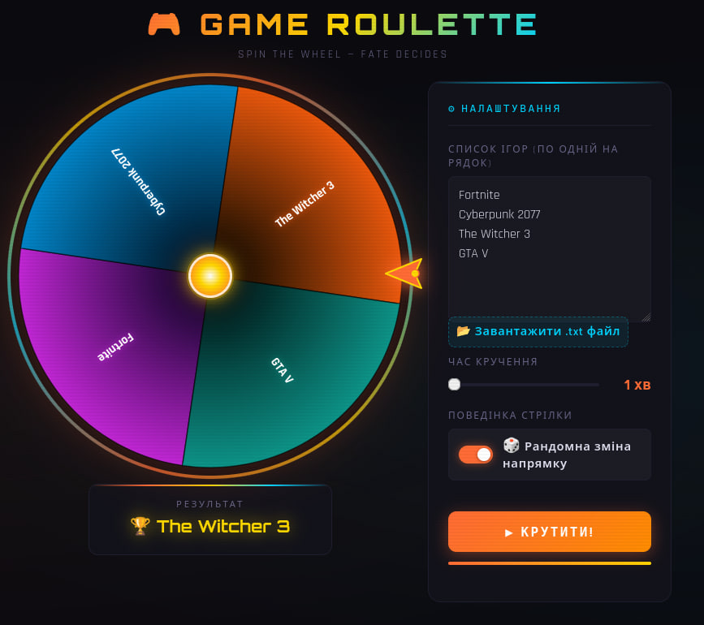

# 🎮 Game Roulette

> 🎯 Stylish interactive roulette for choosing your next game.

Game Roulette is a modern, animated web app that helps you decide what to play next.  
Just add a list of games, spin the wheel, and let fate choose 🎲



---

## ✨ Features

- 🎮 Custom game list (one per line)
- 📂 Import games from `.txt` file
- 🎰 Smooth animated spinning
- ⏱ Adjustable spin duration (1–10 minutes)
- 🎲 Crazy Mode (random direction changes)
- 🏆 Winner animation
- 🎉 Confetti celebration
- 📱 Responsive design
- 🌈 Neon cyber-style UI

---

## 🚀 Demo

Open `GameRoulette.html` in your browser.  
No build, no backend — works offline ✅

---

## 🛠 Tech Stack

- HTML5 Canvas
- Vanilla JavaScript
- CSS (animations, gradients, glow effects)

---

## 📦 How to use

1. Enter your games (one per line):

   ```
   Minecraft
   Cyberpunk 2077
   Elden Ring
   ```

2. Set spin duration  
3. (Optional) Enable 🎲 Crazy Mode  
4. Click **SPIN**  
5. Enjoy the result 🎯  

---

## 🧠 How it works

- The wheel is rendered using **Canvas**
- Each game is a segment of the wheel
- Animation uses smooth easing:
  - acceleration → constant speed → slowdown
- Winner is calculated based on pointer angle

---

## ⚡ Features in detail

### 🎲 Crazy Mode
- Randomly changes direction while spinning
- Adds chaos and unpredictability

### 🎉 Confetti
- Particle-based animation
- Plays for ~5 seconds after spin

### 🎰 Smooth Physics
- Time-based animation
- Consistent speed independent of FPS

---

## 📌 Project structure

```
GameRoulette.html
GameList.txt
README.md
```

---

## 🌍 Use cases

- 🎮 Choosing what to play
- 🎥 Stream interaction tool
- 🎉 Party games
- 🎁 Giveaway picker

---

## 📄 License

MIT License
